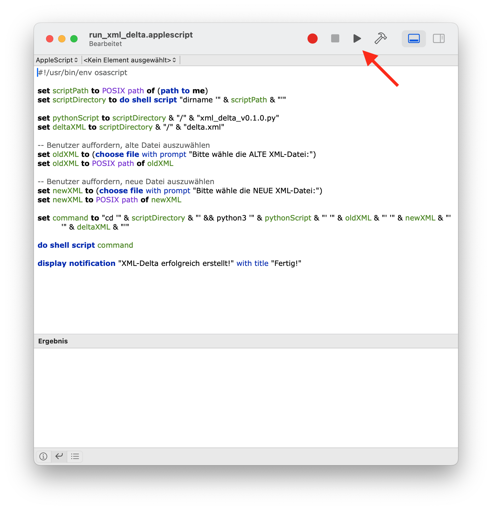

# XML-Delta
Script to compare two XML files and create a new file that only contains new data (delta)

## Funktionsumfang
- Vergleicht exakt zwei XML-Dateien aus dem Ordner `Input`.
- Prüft die Anzahl der Eingabedateien und akzeptiert ausschließlich Dateien mit der Endung `.xml`.
- Ermittelt anhand des Erstelldatums automatisch die ältere Datei als `ALT` und die neuere als `NEU`.
- Erkennt unterstützte XML-Strukturen mit `item`- oder `speaker`-Elementen.
- Vergleicht Einträge anhand stabiler Schlüssel aus Titeln und Sprechernamen.
- Erkennt neue und geänderte Einträge und schreibt ausschließlich diese in die Delta-XML-Datei.
- Gibt gelöschte Einträge im Log aus, übernimmt sie jedoch nicht in die Delta-Datei.
- Verarbeitet XML-Namespaces, ohne feste Namespace-Präfixe vorauszusetzen.
- Erhält Root-Element, Attribute, Namespaces und XML-Deklaration des neuen Dokuments.
- Erzeugt die Delta-Datei automatisch im Ordner `Output` mit dem Dateinamen `ALT__NEU__delta.xml`.
- Erstellt ein plattformübergreifendes Text-Log unter `Output/xml_delta.txt`.
- Unterstützt den ausführlichen `--debug`-Modus und den `--dry-run`-Vorschaumodus.
- Gibt verständliche Validierungs- und Parsing-Fehler bei ungültigen Eingabedaten aus.
- Enthält ein macOS-AppleScript für die Ausführung per Doppelklick und das automatische Öffnen des Logs nach erfolgreicher Ausführung.

## Voraussetzungen
### 1. Python 3
- überprüfen, ob Python 3 bereits installiert ist:
  - folgenden Code kopieren: `python3 --version`
  - App TERMINAL öffnen
  - Code einfügen und mit ENTER bestätigen
  - wenn Ausgabe **"Python 3.x.y"** (oder höher):
    - weiter zu Punkt 2.
  - andernfalls:
    - Python 3 von hier herunterladen und installieren: https://www.python.org/downloads/macos/

### 2. lxml
- lxml installieren
  - folgenden Code kopieren: `pip3 install lxml`
  - App TERMINAL öffnen
  - Code einfügen und mit ENTER bestätigen

## Installation
Zunächst sicherstellen, dass die beiden Voraussetzungen erfüllt sind (siehe oben).
- Neueste Version des Tools herunterladen: https://github.com/mschuetze/XML-Delta/releases
  - das ZIP findet sich in der unteren Hälfte des Kastens, bezeichnet als **Source code (zip)**
- ZIP entpacken und im Ordner deiner Wahl ablegen (z.B. Schreibtisch)

## Benutzung
ACHTUNG: Für die Nutzung des Skripts benötigen wir sowohl das aktuelle XML, als auch das "alte".
- aktuelles XML, welches die Änderungen / Ergänzungen enthält, hier herunterladen: https://conferences-preview.s3-website-eu-west-1.amazonaws.com/#/conferences
- mittels **conferenceTransform** die 4 XML-Dateien für den Workflow erstellen
- altes + neues XML in Ordner **INPUT** kopieren (jeweils einzeln für die 4 Dateien)
- Datei **run_xml_delta.applescript** doppelklicken und in Skripteditor ausführen (Play-Button, oben rechts)
  
- neues XML wird in Ordner **OUTPUT** generiert
- diese XML-Datei in den Projektordner verschieben / kopieren
- weiter mit dem regulären SoMe-Programmgrafiken-Workflow

> [!IMPORTANT]
> **Bitte alle XML-Dateien im Projektordner aufbewahren und nicht löschen!**